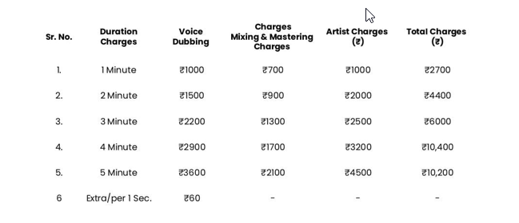

# **Quotation for Voice Dubbing & Production Services**

**To:** example@gmail.com  
**Subject:** Voice Dubbing & Production Services

**Dear Client**

Thank you for considering **Clovr - DESIGN STUDIO** for your project. Please find below our formal quotation for the requested services.

## **Terms & Conditions**

1. **Payment:** 100% advance payment required to initiate project.
2. **Services Included:** Studio recording, voice editing, and final mastering.
3. **Artist Charges:** May vary for premium voice talents.
4. **Turnaround Time:** 2-4 working days (depending on script length).
5. **Taxes:** GST @12% applicable on total amount.
6. **Revisions:** Additional changes beyond scope will be charged extra.

## **Next Steps**

To proceed, please:

1. Confirm your acceptance of this quotation
2. Specify your required service duration
3. Provide final script/content

We will then share payment details and begin production.

We appreciate your business and look forward to working with you!

**Best regards,**  
**CLOVR DESIGN STUDIO**
